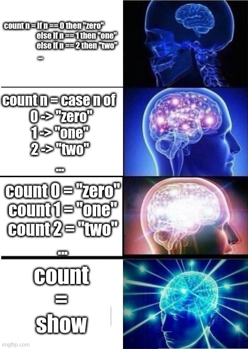

# Branching

## What

When creating a program it is essential to be able to tell the program to act differently depending on the input.

Imagine you were in charge of Google search. I can imagine your users would get pretty cross if every search they make took them here: https://www.youtube.com/watch?v=DLzxrzFCyOs. The search needs to look at the input and act accordingly. You want programs you create to be able to go "I understand that you don't want milk in your tea, so here is a black tea".

Branching in programming is how you specify the decision tree you would like your program to follow. You can think of it as guiding the program through a flow chart like this:

```
          ------------------
          | Tea or Coffee? |
          ------------------
                 /\
                /  \
        "Tea"  /    \  "Coffee"
              /      \
             /        \
  --------------    -----------------
  | *Make tea* |    | *Make coffee* |
  --------------    -----------------
```

## Branching in Haskell

Haskell has lots of fun ways of making decisions based on inputs!

We have:
* if statements
* case statements
* pattern matching
* guards

Just like spoken languages, this dialect provides numerous ways of saying the same thing. For example, in English, I can tell you _"You must love Haskell"_, or I could say _"Love haskell, you must"_. Both express the same valuable advice, but you might have noticed that one of these commandments makes more sense to you, while the other might make more sense to Yoda. In other words, one is more "idiomatic" to you.

Programming paradigms have the same notion of idioms as spoken languages. This means that some ways of programming functionally are more natural than others. In the same way that a native English speaker might use phrases like _"it is raining cats and dogs"_, where a foreigner might just say _"it is raining hard"_; a native functional programmer (who knows the value of concise, yet clear programs) would utilise pattern matching and guards, where a newbie that comes from an imperative background might continue to use the verbose if and case statements they are familiar with from their imperative home.

Here is what all the methods of expression look like:

```haskell
-- Imperative Style:
ifStatements = if b then this else that
caseStatements = case b of
                  True  -> this
                  False -> that
-- Haskell Style:
patternMatching True  = this
patternMatching False = that
guards b
  | b         = this
  | otherwise = that
```

To properly embrace the functional paradigm, I recommend that you favour guards and pattern matching. To find out more about each of these branching methods, you can look at the "Guards" and "Pattern Matching" notes.



TLDR; pattern matching is just a more concise version of case statements, good for making the decision on the value of the input type alone, then guards are your Haskell version of if then else blocks, where decisions depend upon predicates of the input value.
