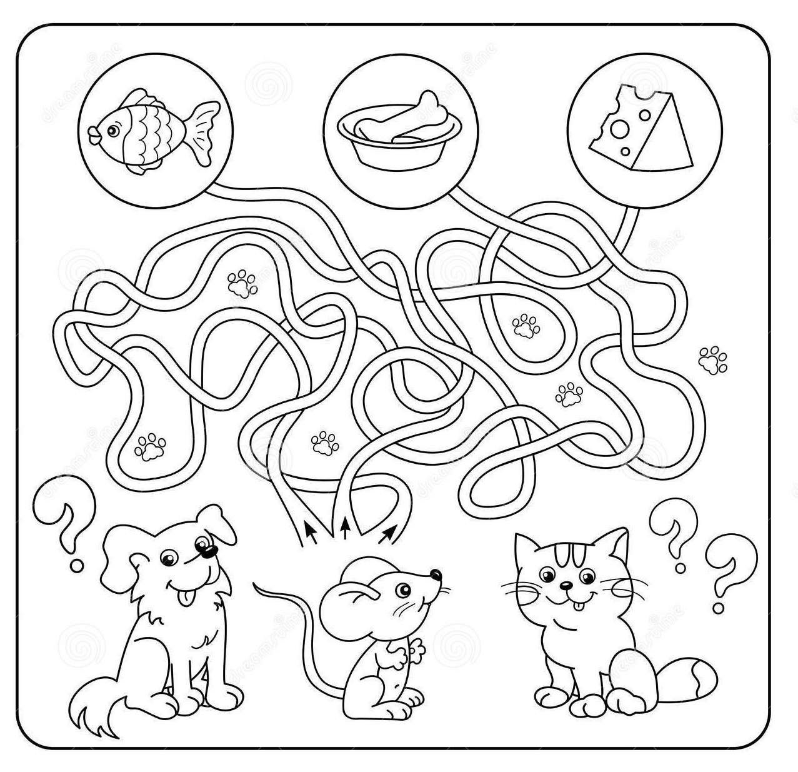

# Data.Map

Maps are a very useful data structure. You can import them from the `Data.Map` library. To include Maps in your program you can add `import Data.Map` to the top of your Haskell file and the lovely compiler will go and fetch all the beautiful functions that come with Maps for you.

Sadly, one does not simply just import `Data.Map` since this will lead to name conflicts. It will be like at school when you have three Olivers in your class: the compiler much like a teacher will not know what to do when faced with three functions (or homeworks) all named "Oliver". In order to solve this, you can be more specific with your importing:

```haskell
import qualified Data.Map as Map
```

With this statement you can use all the prelude functions normally and then when you want to use a `Data.Map` function you just prefix the name of the function with `Map.`. For example, if I wanted to use the `empty` function from `Data.Map` I would type `Map.empty`. What a fantastically easy way of telling the different function sets apart! It is kind of like family names.

NOTE:- You do not have to choose "Map" you can import your Map function with whatever prefix that you want. So, if you are lazy at typing then go ahead and `import qualified Data.Map as M`. If you love writing confusing and difficult to understand code then feel free to `import qualified Data.Map as pinkFluffyUnicornsDancingOnRainbows` while you rethink your life and maybe look into code readability.

Okay but what actually are Maps???

Maps are an abstract data structure that connect keys to values. They are like an address to a register; the address maps the CPU to the value it is storing. (Wow that is probably the most relevant and computer sciencey example I have ever used.) Equally you can think of it as a phone book, which is a map that matches people to phone numbers.

You are not allowed to know how Maps are actually stored and implemented under the hood since this allows the Haskell wizards to update it for something more efficient without us knowing. Literally all you need to know is that Maps connect a key to a value:



The keys and values can be of any data type, although keys should be orderable (i.e. derive `Ord`) since this allows the Haskell wizards to work their magic and make Maps very efficient.
