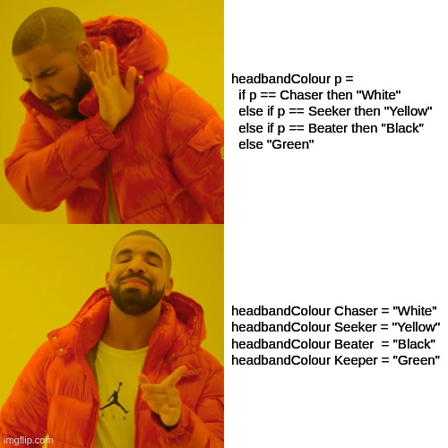

# Pattern Matching

## Motivation



Seriously, why would you use if statements with all those unnecessary words, when you can pattern match in a lovely concise and clear way, all aligned and pretty?

## What

Pattern Matching is the bread and butter of Haskell programming. If you are looking to define a function and you don't know what to do -  PATTERN MATCH! All pattern matching consists of is going through case by case what you want your function to do. Normally, this involves going through all the possible constructors of a data type. Observe:

```haskell
germanTranslationRobot :: Bool -> String
germanTranslationRobot False  =  "Falsch"
germanTranslationRobot True   =  "Richtig"
```

Looking at the type signature of this function you can see that it takes in a `Bool` and returns a `String`. This function can only have two possible inputs: `True` or `False`, _Richtig oder Falsch_, making the pattern matching very simple. The first line of the definition tells the function what to do if the input is `True`; the second line tells it what to output when it receives `False`.

Lines in a definition follow the same structure: name of function, inputs that you are pattern matching on, equals sign to separate the context from the result, and an expression that tells the function what it's actually going to do. The LHS of the equals is like the description of the case in which you want the matching code on the RHS to be executed. You are just comprehensively informing the function what you want it to do: "`germanTranslationRobot` when you are given `True` could you please return the string `"Richtig"`. Thank you! :-)".

## Pattern Matching on Lists

One pattern match that you will do so much that it will almost become part of your being is pattern matching on lists. Recall that lists have two constructors: `[]` and `(:)`. Since when you pattern match you always start with the base case the first line of a pattern match on lists will normally be telling the function what to do when it is given the empty list. The next line will say what to do with the rest of the list.

```haskell
sum :: Num a => [a] -> a
sum []      =  0
sum (x:xs)  =  x + sum' xs
```

Hopefully the first line of the definition makes sense. `sum` is being told to return 0 if it is given `[]` as its input since well the sum of nothing is nothing. The second line is a little odd the first time you see it. `(x:xs)` just represents a list where you have called the first item `x` and the rest of the items `xs` so you can easily tell the function to add the first item to the sum of the rest of the items. Remember `x` and `xs` are just names. You could still write whatever you want, for example:

```haskell
sum (first:rest) = first + sum' rest
```

Notice how `(x:xs)` is in brackets? This is so that the compiler can type check your pattern matching and know that `x:xs` is only referring to the first parameter of the function, something that will become more important when you progress to pattern matching on more than one input.

Here is another list pattern match example that uses the `_` wildcard syntax:

``` haskell
take :: Int -> [a] -> [a]
take _ []      =  []
take 0 _       =  []
take n (x:xs)  =  x : (take' (n-1) xs)
```

`take` is a function that takes in an `Int`, and a list, and produces a list, basically it plucks the first `n` elements of the inputted list and places then in the new list. The definition of `take` is a good example of using the underscore. If `n=0` we don't care what the list is since we know that we are just going to return the empty list. Same with if the inputted list is empty. It doesn't matter what `n` is since there is nothing to take from anyway.


