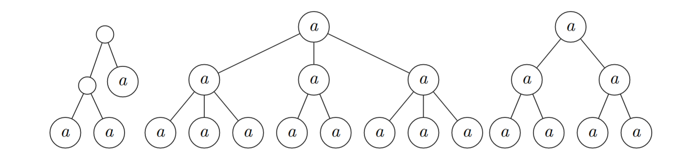
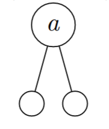
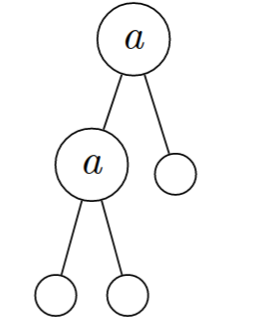
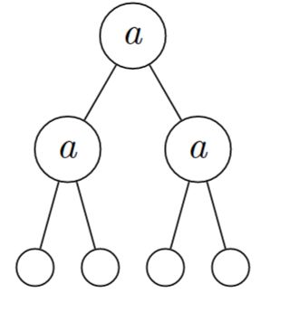

# Trees

We already know how to represent data as a list in Haskell, that is pretty easy since lists are so integral in the foundations of Haskell. However sometimes we want to use other data structures to store our data. One such data structure is trees. The great thing about Haskell is that using the `data` constructor you can make many cool data types and structures, you could even make a bunch of different trees and end up with a forest:



Trees are *recursive* data structures. This means that the name of the data structure appears at some point on the RHS of the data definition, meaning that the data structure can propagate its way downwards. Let's have a look at one way of making a tree:

```haskell
data Tree a  =  Tip
             |  Node (Tree a) a (Tree a)
            deriving Show
```

What does this mean? Well anywhere you see `Tree a` on the RHS of the data definition this can either be replaced with a `Tip` or a `Node` when making a concrete example of a tree. The polymorphic `a` is where the data is stored. The best way to see how this Haskell representation of trees actually works is to draw a bunch of trees. So let's start with the simplest kind of `Tree a` that we can possibly make: a `Tip`. Shall we name him? Yeah of course! Let's call him Groot. As Groot has grown I have make him a little baby book:


`Tip`:


`Node (Tip) a (Tip)`:



`Node (Node (Tip) a (Tip)) a (Tip)`:



`Node (Node (Tip) a (Tip)) a (Node (Tip) a (Tip))`:



Aw they grow up so fast!

You can think of a `Tree a` as a blank that can either be filled with either a `Node` or a `Tip`, and naturally if you go for `Node` you will then have more blanks to fill in. Our representation of trees must have each branch eventually ending in a `Tip`. This is very similar to how the `[]` works for lists, the recursive data structure that you have already met.
