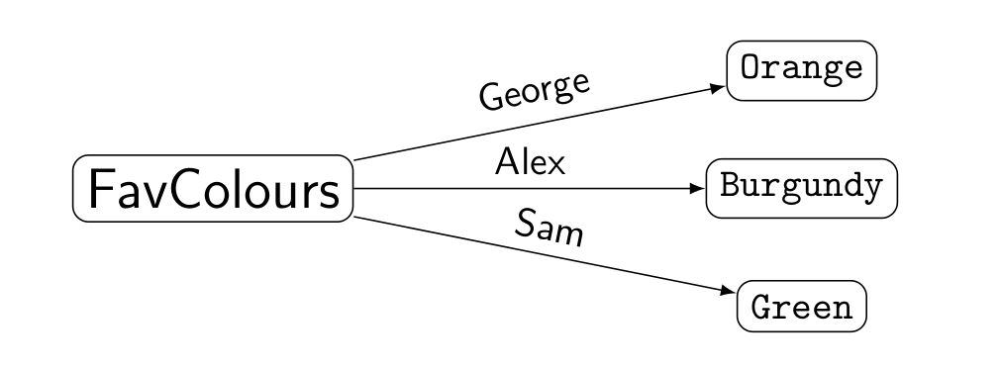
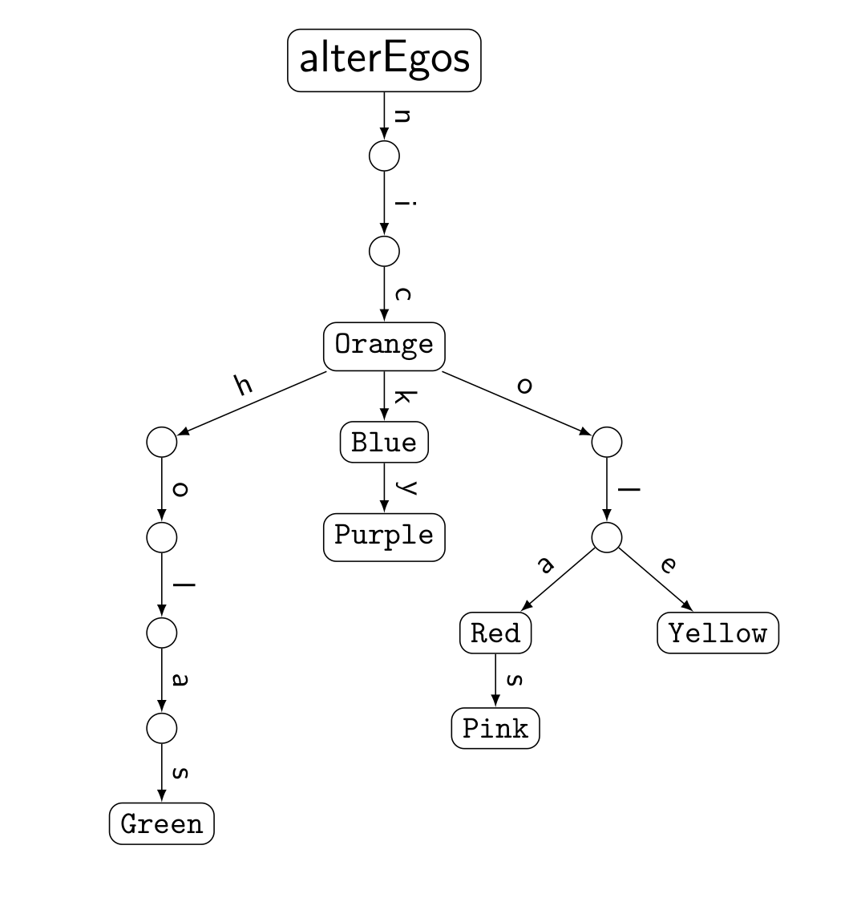
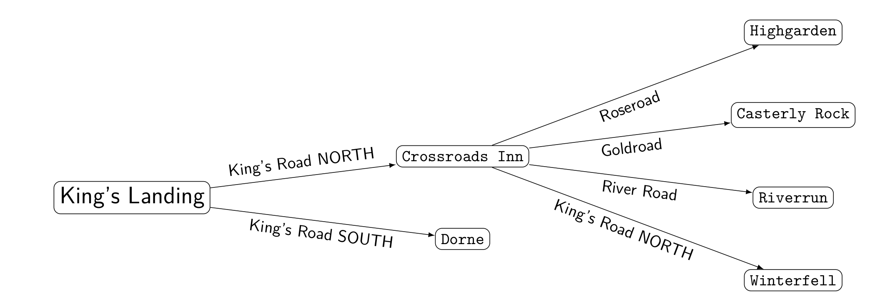
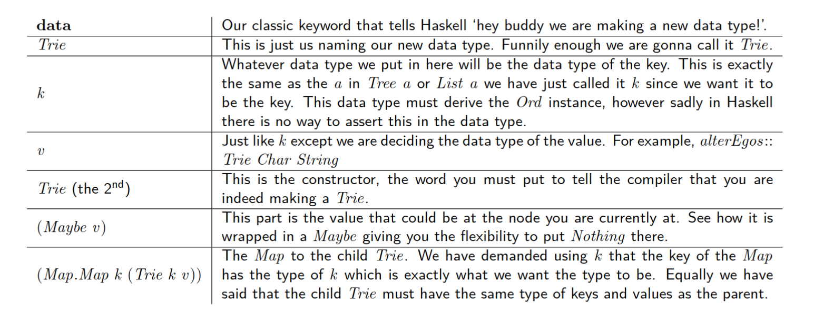

# Trie

Maps are great. You can have a key and it leads to a value. For example, you can map peoples' names to their favourite colours:



But what if you have lots of names that are realllly similar. Take Nick, he has a lot of alter egos:

  * Nic
  * Nick
  * Nicky
  * Nicolas
  * Nicholas
  * Nicola
  * Nicole
  * (Zenzike)

Say each of these alter egos had a different favourite colour and we wanted to keep track of this in a `Map` that wouldn't be very efficient. Most of the names begin with "Nic" meaning that there would be lots of repeated data in our keys. Wouldn't it be nice if this could be shared? Well this is where `Trie`s comes in.

A `Trie` is a hybrid cross over between a `Map` and a `Tree`. They are preferable to `Map`s when your key can be broken down, for example, if you key is a `String` or any other list. Let's see what the `Trie` for Nick's alter egos looks like:



In the above `Trie` each node has two parts: the value and a `Map`. The value is wrapped in a `Maybe` since there may or may not be a value stored there. There is no pressure to have a favourite colour. Then there is the `Map` to another `Trie`, the child `Trie`. This `Map` could be empty and lead nowhere, see on the diagram how there is nothing below `Green`, `Pink`, or `Yellow`. Likewise, it could lead on in the same way that `"Nicola"` leads to `"Nicolas"`.

Additionally, see now how the keys to the colours share common letters? Much better than `Map`s! So space saving. Much efficiency. All the wonder. To extract the colour, you want you follow one letter at a time. The letters of the name are like a breadcrumb trail leading to the correct colour. I also like to think of the keys as road names that tell you which fork in the `Trie` to take in order to get to your destination.



For example, the above `Trie` represents the map of Westeros (a setting for a popular show that you may or may not have heard of, other maps and tv shows are available). While this does not exhibit the way that `Trie`s can take advantage of breaking keys down and sharing, it does help get into your head how the functions for `Trie`s know what to do. Throughout out my explanation of functions for `Trie`s I will refer back to this `Trie` because it is fun and I like it and we can pretend together that we are going on an adventure.

But first the nitty-gritty of how `Trie`s are built. `Trie`s are constructed as follows:

```haskell
data Trie k v = Trie (Maybe v) (Map.Map k (Trie k v))
```

Since this is quite a complicated and strange data type let's look at each part individually. I'll even put it in a fabby table for you so you!



<!-- |  Part                      | Meaning                                                                                                                                                                                                                                                                                                              |
|---------------------------:|----------------------------------------------------------------------------------------------------------------------------------------------------------------------------------------------------------------------------------------------------------------------------------------------------------------------|
|  `data`                    |  Our classic keyword that tells Haskell `hey buddy we are making a new data type!'.                                                                                                                                                                                                                                  |
|  `Trie`                    |  This is just us naming our new data type. Funnily enough we are gonna call it `Trie`.                                                                                                                                                                                                                               |
|  `k`                       |  Whatever data type we put in here will be the data type of the key. This is exactly the same as the `a` in `Tree a` or `List a` we have just called it `k` since we want it to be the key. This data type must derive the `Ord` instance, however sadly in Haskell there is no way to assert this in the data type. |
|  `v`                       |  Just like `k` except we are deciding the data type of the value. For example, `alterEgos :: Trie Char String`                                                                                                                                                                                                       |
|  `Trie` (the 2nd)          |  This is the constructor, the word you must put to tell the compiler that you are indeed making a `Trie`.                                                                                                                                                                                                            |
|  `(Maybe v)`               |  This part is the value that could be at the node you are currently at. See how it is wrapped in a `Maybe` giving you the flexibility to put `Nothing` there.                                                                                                                                                        |
|  `(Map.Map k (Trie k v))`  |  The `Map` to the child `Trie`. We have demanded using `k` that the key of the `Map` has the type of `k` which is exactly what we want the type to be. Equally we have said that the child `Trie` must have the same type of keys and values as the parent.                                                          | -->


> BONUS:- `Trie` has kind `* -> * -> *`

After constructing this data type you can then ask GHCi what the type of a `Trie` is and it will say:

```haskell
Trie :: Maybe v -> Map.Map k (Trie k v) -> Trie k v
```

Basically "Give me a value (`Maybe`, you don't have to if you don't want to) and a `Map` to a child `Trie` and I will make you a shiny new `Trie`!".

Now we will go through a couple of key functions for working with `Trie`s using our Game of Thrones (ummm I mean unnamed tv show) `Trie`.

```haskell
empty :: Trie k v
```

`empty` is a function that will spit out an empty `Trie` for you.

```haskell
empty = Trie Nothing Map.empty
```

In the empty `Trie` you (obviously) have no value, and the `Map` leads nowhere. It is all thrilling stuff.

```haskell
lookup' :: Ord k => [k] -> Trie k v -> Maybe v
```

> NOTE:- since we couldn't assert that they keys (`[k]`) derive the `Ord` instance in the data type we must do that here in order to appease the Haskell Wizards. Maybe one day they will grant us with dependent types...

`lookup` is a function which when given a list of keys and a `Trie` will produce you a value if that value lies in the `Trie` in the described location. The list of keys is like a list of directions. For example, if I wanted to direct you to `Winterfell` in `westeros :: Trie String String` I would tell you to take the King's Road North, and then the King's Road North i.e.`lookup ["King's Road NORTH", "King's Road NORTH"] westeros` will return `Winterfell`.

```haskell
lookup []      (Trie mv kvs) =  mv
lookup (k:ks)  (Trie mv kvs)
  = case (Map.lookup k kvs) of
      Nothing   ->  Nothing
      Just t    ->  lookup ks t
```

The first line of this function deals with the base case (`[]`). Picture this: I am a weary traveller following a list of directions on my scroll and I look down to see that I have no more directions left, which can mean one of two things: either I have reached my destination, or I am lost. Either way I want to look about where I am right now, at my `mv`. If I have made it then then I will find a `Just a`, otherwise I will be sad and find `Nothing`.

The next line introduces the other case: the situation in which I still have journeying to complete (`k:ks`, where `k` is my next direction and `ks` is the rest of my route). Let's pretend that I at the `Crossroads Inn` enjoying a lovely pie and I look at my route card to plot my next move. My trusty scroll tells me that I should take the `River Road` next so I get out my `Map` and see if I can find said road on it. Now either I will not find it on the `Map` and my journey will amount to `Nothing` or I will manage to find it and continue on my merry way to my next location, following this same protocol when I get to the next fork in the path.
